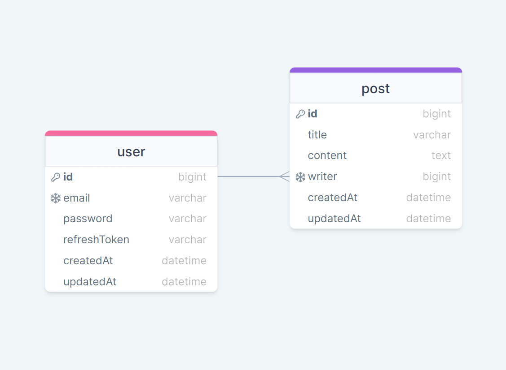

# 원티드 프리온보딩 백엔드 인턴십 - 선발 과제

- [원티드 프리온보딩 백엔드 인턴십 - 선발 과제](#원티드-프리온보딩-백엔드-인턴십---선발-과제)
  - [1. 지원자의 성명](#1-지원자의-성명)
  - [2. 애플리케이션의 실행 방법](#2-애플리케이션의-실행-방법)
  - [3. 데이터베이스 테이블 구조 (링크)](#3-데이터베이스-테이블-구조-링크)
  - [4. 구현한 API의 동작을 촬영한 데모 영상 (링크)](#4-구현한-api의-동작을-촬영한-데모-영상-링크)
  - [5. 구현 방법 및 이유에 대한 간략한 설명](#5-구현-방법-및-이유에-대한-간략한-설명)
  - [6. API 명세 (링크)](#6-api-명세-링크)
  - [(선택) 클라우드 환경에 배포 환경을 설계하고 애플리케이션을 배포한 경우](#선택-클라우드-환경에-배포-환경을-설계하고-애플리케이션을-배포한-경우)

# 1. 지원자의 성명

안녕하세요. 지학수 입니다.
<br></br>

# 2. 애플리케이션의 실행 방법 (엔드포인트 호출 방법 포함)

본 지원자는 배포를 하지 않았기에 로컬에서의 실행방법을 설명드립니다.

- **2-1. github 저장소를 로컬에 클론합니다.**

  프로젝트 소스코드를 다운로드할 경로로 이동합니다.
  다음 명령어를 통해 github 원격 저장소를 로컬에 클론합니다.

  ```bash
  git clone https://github.com/MintZzz1009/wanted-pre-onboarding-backend.git
  ```

- **2-2. 로컬에 클론한 저장소로 이동한 후 .env 파일을 생성합니다.**

  ```bash
  cd wanted-pre-onboarding-backend/
  echo > .env
  ```

- **2-2. .env 파일에 필요한 환경 변수들을 입력합니다.**

  ```.env
  PORT = 80

  # MySQL
  DB_USERNAME='root'
  DB_PASSWORD=''
  DB_DATABASE='test'
  DB_HOST='127.0.0.1'

  # JWT
  TOKEN_SECRET='jwt_secert_key'
  ACCESS_TOKEN_EXPIRED = '1d'
  REFRESH_TOKEN_EXPIRED = '14d'

  # 페이지네이션
  PAGE_SIZE = '10'
  ```

  접속할 로컬의 MySQL 서버의 아이디와 비밀번호, 생성할 데이터베이스의 이름을 입력합니다.

- **2-3. 다음 명령어를 입력하여 package.json에 입력된 모듈들을 다운로드 합니다.**

  ```bash
  npm i
  ```

- **2-4. 다음 명령어를 입력하여 MySQL 데이터베이스 생성과 테이블 생성을 합니다.**

  ```bash
  npx sequelize db:create
  npx sequelize db:migrate
  ```

- **2-5. 다음 명령어를 입력하여 서버를 실행합니다.**

  ```bash
  npm run dev
  ```

- **2-6. 엔드포인트 호출을 위해 VScode의 익스텐션인 `Thunder Client`를 설치합니다.**

  - Thunder CLient 설치 후, 좌측 탭에 생성된 Thunder Client 버튼을 눌러 실행합니다.

  - Thunder Client가 실행되면 탭의 최상단에 New Request 버튼을 클릭하여 새로운 API를 실행할 수 있습니다.

  - Thunder Client를 통한 엔드포인트의 호출 방법은 [API 명세서](https://jet-tv-83b.notion.site/40e36cbba09446108a8977b202d2d559?v=961ce0412cd149089d2022f4a7e9c514&pvs=4)와 [데모 영상](https://youtu.be/iejcjAJzyTQ)을 참고바랍니다.
    <br></br>

# 3. 데이터베이스 테이블 구조


[링크](https://www.erdcloud.com/p/4ouaNgGNEtBu4Zd7y)
<br></br>

# 4. 구현한 API의 동작을 촬영한 데모 영상 링크

[링크](https://youtu.be/iejcjAJzyTQ)
<br></br>

# 5. 구현 방법 및 이유에 대한 간략한 설명

- **과제 1. 사용자 회원가입 엔드포인트**

  a. 이메일과 비밀번호의 유효성 검사 기능은 `Validator` 미들웨어로 구현하여 로그인 요청시에도 사용할 수 있도록 하였습니다.

  - 원래 비즈니스 계층인 service에 validator 기능을 구현하려고 했으나, 이번 프로젝트를 통해 미들웨어로 구현하여 좀 더 객체지향적이고 직관적인 코드를 구현해보고 싶어 시도하였습니다.

  b. 비밀번호의 암호화에는 연산 속도를 늦춰 보안을 강화하기 위해 bcrypt 모듈을 사용했습니다.

  c. 이메일과 비밀번호가 유효한 경우, DB에 같은 이메일이 존재하는지 확인하고 문제가 없으면 새로운 사용자를 생성합니다.

  d. 사용자에게 201 상태코드와 메시지를 응답합니다.

- **과제 2. 사용자 로그인 엔드포인트**

  a. 로그인 요청시 미들웨어를 통해 유효성 검사가 진행된 후, DB에서 이메일과 비밀번호의 일치를 확인합니다.

  b. 이메일과 비밀번호가 검증되면, 서버에서는 `Token` 미들웨어를 통해 JWT 토큰을 발급합니다.

  - 토큰 탈취에 대비해서 accessToken과 refreshToken을 발급하였습니다.

  - accessToken은 응답을 통해 사용자의 쿠키에 저장되고, refreshToken은 DB에 저장됩니다. user 자원의 일부를 수정하기 때문에 PATCH 메서드를 사용하였습니다.

  - 로그아웃 요청시에는 토큰의 유효기간 검증없이 토큰에 담겨있는 사용자 정보만 확인합니다. 확인 후 accessToken은 쿠키에서 지워지고, 사용자 정보에 해당하는 refreshToken은 DB에서 삭제되도록 구현하였습니다.

  - 토큰이 삭제되는 의미를 담아 RESTful한 설계를 위해 DELETE 메서드를 사용하였습니다.

  c. 토큰 발급이 끝나면 사용자에게 200 상태코드와 메시지를 응답합니다.

- **과제 3. 새로운 게시글을 생성하는 엔드포인트**

  a. 제목과 내용을 입력하여 POST 요청을 보냅니다.

  b. 요청은 먼저 Token 미들웨어를 통해 토큰의 유효기간을 검증합니다.

  - 토큰 검증시에는 먼저 accessToken의 유효기간을 확인합니다. 만료시에는 DB의 refreshToken의 유효기간을 확인하여 유효할시 accessToken을 재발급합니다.

  - refreshToken도 만료되었을 경우에는 재로그인을 통해 토큰을 생성한 후 게시글을 작성할 수 있도록 유도하는 메시지를 응답합니다

  - 만일, accessToken은 유효한데 refreshToken이 만료되었다면 accessToken을 삭제하고 다시 로그인하도록 메시지를 응답합니다. refreshToken을 재발급하지 않는 이유는 accessToken을 탈취당할 경우 refreshToken이 보안적으로 무의미해지기 때문입니다.

  c. 토큰의 유효기간 검증이 끝나면, 토큰을 decode하여 사용자의 일련번호를 확인하여 작성자를 확인합니다.

  d. 작성자가 확인되면 게시글 제목과 내용에 대한 유효성 검사를 미들웨어를 통해 진행합니다.

  e. 유효성 검사까지 끝나면 작성자 정보와 게시글의 제목과 내용을 DB에 저장합니다.

  f. 사용자에게 201 상태코드와 메시지를 응답합니다.

- **과제 4. 게시글 목록을 조회하는 엔드포인트**

  a. 쿼리스트링으로 페이지번호를 입력하여 GET 요청을 보냅니다.

  b. 서버에서는 페이지번호를 확인하여 해당하는 로직을 실행합니다.

  - 만일 페이지네이션 없이 모든 데이터를 조회하고자 한다면 페이지번호에 `all`을 입력하면 됩니다.

  - 1 페이지당 조회하는 게시글의 수는 서버에서 상수(기본값 10)로 정의되어 있습니다.

  - `페이지번호 > (게시글의 총 개수 / 페이지당 게시글의 수) + 1` 일 경우, 마지막 페이지가 조회되도록 구현하였습니다.

  c. DB에서 게시글을 조회할 때는 post 테이블의 외래키인 writer를 통해 해당하는 작성자의 이메일이 user 테이블에서 함께 조회됩니다.

  d. 사용자에게 게시글 목록과 200 상태코드를 응답합니다.

- **과제 5. 특정 게시글을 조회하는 엔드포인트**

  a. URL의 파라미터를 통해 게시글 번호를 입력하여 GET 요청을 보냅니다.

  b. 서버에서 해당하는 특정 게시글을 작성자의 이메일과 함께 데이터베이스에서 조회합니다.

  c. 사용자에게 게시글 목록과 200 상태코드를 응답합니다.

- **과제 6. 특정 게시글을 수정하는 엔드포인트**

  a. URL의 파라미터를 통해 게시글 번호를 입력하고, 수정할 제목과 내용을 body에 입력하여 PUT 요청을 보냅니다.

  - 특정 게시글의 제목과 내용을 모두 요청에 담아 보내므로 자원의 전체가 수정되는 것에 해당하기 때문에 PUT 메소드를 사용하였습니다.

  b. 과제 3에서 새로운 게시글을 생성할 때와 마찬가지로 token의 유효기간을 확인합니다.

  c. 유효기간을 확인한 후에는 token의 정보를 통해 수정 요청을 보낸 사용자와 해당하는 게시글의 작성자가 동일한지 확인합니다.

  d. 요청자와 작성자가 동일하다면 게시글을 수정하여 데이터베이스에 저장합니다.

  e. 사용자에게 201 상태코드와 메시지를 응답합니다.

- **과제 7. 특정 게시글을 삭제하는 엔드포인트**

  a. URL의 파라미터를 통해 게시글 번호를 입력하여 DELETE 요청을 보냅니다.

  b. 과제 6과 마찬가지로 token의 유효기간을 확인한 후, 게시글 작성자와 삭제 요청자가 동일한지 검증합니다.

  c. 요청자와 작성자가 동일하다면 특정 게시글을 DB에서 삭제합니다.

  d. 사용자에게 204 상태코드를 응답합니다.

<br></br>

# 6. API 명세(request/response 포함)

[링크](https://jet-tv-83b.notion.site/40e36cbba09446108a8977b202d2d559?v=961ce0412cd149089d2022f4a7e9c514&pvs=4)
